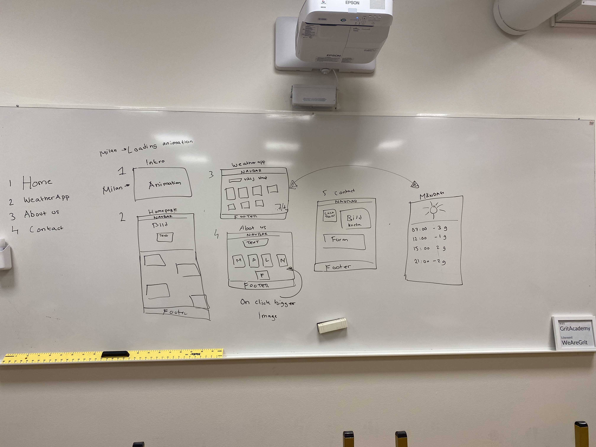

# FE22-VH-Group-4 WeatherFeather

## WeatherFeather
https://milantranda.github.io/FE22-VH-Group-4/index.html

Vi är grupp 4 som skapade ett mini-projekt om väderapp med hjälp av openweather api

## Members & Roles
- Milan: (html & css,js)
- Maja:  (html & js)
- Leon:  (html & js)
- Austin: (ux & css)
- Felix:    (ux & css)

## Wireframe

## Mockup
https://www.figma.com/file/eWwnGR4s1xVx6UfbYPYBo1/Version-hantering---Group-4%3A-Weather-App?node-id=0%3A1&t=MUK22nT0YB3I35YB-1

